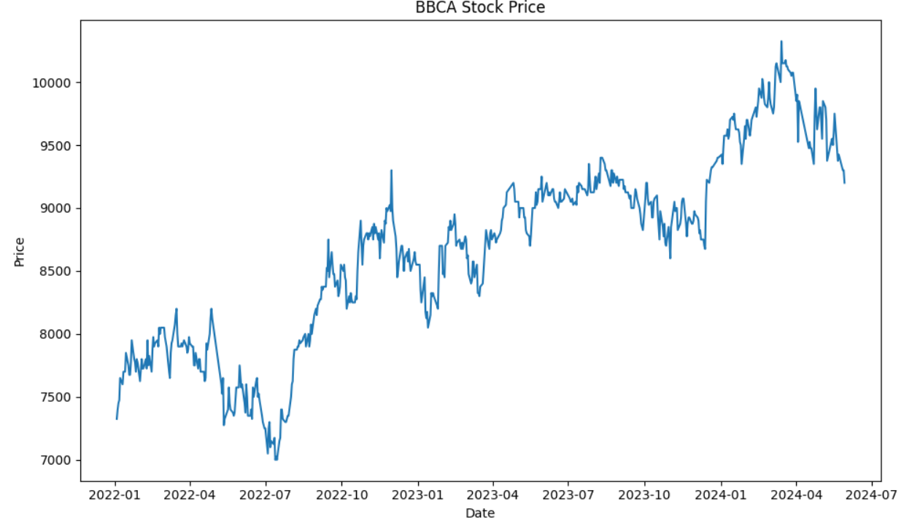
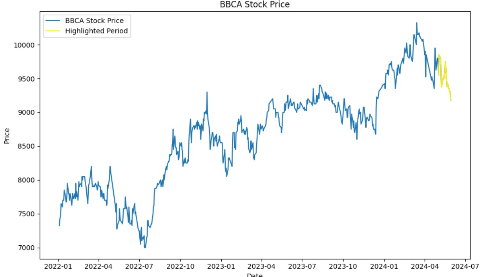

# 📈 BBCA Stock Price Analysis  

## Overview  
This project analyzes the stock price of **Bank Central Asia (BBCA.JK)** using data from Yahoo Finance. It includes data fetching, preprocessing, and visualization to help understand stock price trends over time.  

## Features  
- Fetch historical BBCA stock prices using `yfinance`.  
- Clean and preprocess data for visualization.  
- Generate interactive and static visualizations using Matplotlib, Seaborn, and Plotly.  
- Highlight specific periods for trend analysis.  

## Installation  
1. Clone the repository:  
   ```bash
   git clone https://github.com/yourusername/bbca-stock-analysis.git  
   cd bbca-stock-analysis  
   ```  
2. Install required dependencies:  
   ```bash
   pip install numpy pandas matplotlib seaborn yfinance plotly pandas_datareader  
   ```  

## Usage  
Run the main script to fetch and visualize BBCA stock price trends:  
```bash
python main.py  
```  

## Visualization Samples  
### 📊 BBCA Stock Price Over Time  
  

### 📌 Highlighted Stock Trends (May 2024)  
  

## Issues & Errors  
- `pandas_datareader` is deprecated. Use `yfinance` directly.  
- Some stock tickers may fail due to incorrect formatting.  
- Ensure date formats are correctly parsed when filtering data.  

## Contributing  
Feel free to submit issues or pull requests! 🚀  
